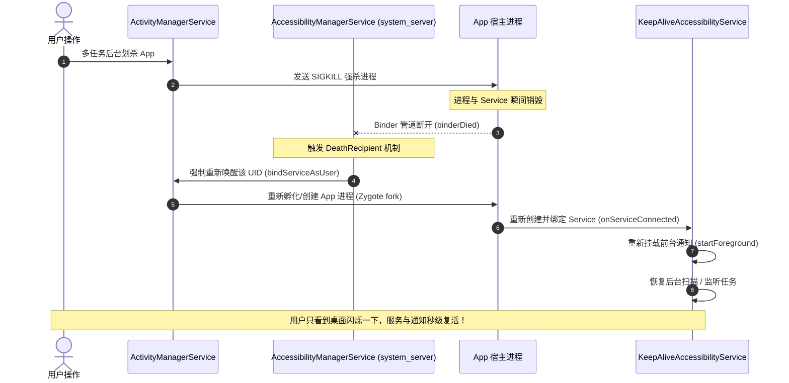

# Android 高可用后台服务与进程防杀技术方案指南
> 深度拆解 BatteryRecorder 的后台架构与无障碍保活机制，以及在本项目（RidMonitoring）中的落地实战

---

## 目录
- [一、 方案概览与技术选型矩阵](#一-方案概览与技术选型矩阵)
- [二、 方案一：无障碍服务保活方案（免 Root / 免 ADB 方案）](#二-方案一无障碍服务保活方案免-root--免-adb-方案)
  - [1. 为什么无障碍权限能做到“划杀防杀”？](#1-为什么无障碍权限能做到划杀防杀)
  - [2. 核心架构与系统底层调用链](#2-核心架构与系统底层调用链)
  - [3. 完整实现代码与配置模板](#3-完整实现代码与配置模板)
  - [4. 前台应用感知与高频事件优化](#4-前台应用感知与高频事件优化)
  - [5. 方案优缺点与适用场景](#5-方案优缺点与适用场景)
- [三、 方案二：Root / ADB 特权独立守护进程方案（终极防杀方案）](#三-方案二root--adb-特权独立守护进程方案终极防杀方案)
  - [1. 方案架构：为什么多任务划杀对它完全无效？](#1-方案架构为什么多任务划杀对它完全无效)
  - [2. 关键核心技术点剖析](#2-关键核心技术点剖析)
    - [2.1 Native 伪装启动器（libstarter.so）与脱离终端](#21-native-伪装启动器libstarterso与脱离终端)
    - [2.2 app_process 启动独立 ART 运行时](#22-app_process-启动独立-art-运行时)
    - [2.3 Linux 内核级 OOM 分数置顶（oom_score_adj = -1000）](#23-linux-内核级-oom-分数置顶oom_score_adj---1000)
    - [2.4 逃逸现代 Android cgroup 冻结组](#24-逃逸现代-android-cgroup-冻结组)
    - [2.5 通知栏寄生在 com.android.shell（UID 2000）](#25-通知栏寄生在-comandroidshelluid-2000)
    - [2.6 双守护进程与主动降权架构（ChildServerBridge）](#26-双守护进程与主动降权架构childserverbridge)
    - [2.7 系统事件感知与 ContentProvider 反向穿透拉活](#27-系统事件感知与-contentprovider-反向穿透拉活)
- [四、 方案三：标准 Android 前台服务 + 系统优化互补方案](#四-方案三标准-android-前台服务--系统优化互补方案)
  - [1. Android 14+ 前台服务类型（ForegroundServiceType）适配](#1-android-14-前台服务类型foregroundservicetype适配)
  - [2. 忽略电池优化（REQUEST_IGNORE_BATTERY_OPTIMIZATIONS）](#2-忽略电池优化request_ignore_battery_optimizations)
  - [3. JobScheduler / WorkManager 定时心跳对齐](#3-jobscheduler--workmanager-定时心跳对齐)
- [五、 在本项目（RidMonitoring 无人机监控）中的落地实战建议](#五-在本项目ridmonitoring-无人机监控中的落地实战建议)
  - [1. 业务场景与保活痛点分析](#1-业务场景与保活痛点分析)
  - [2. 推荐落地实施路线](#2-推荐落地实施路线)

---

## 一、 方案概览与技术选型矩阵

在 Android 平台上，随着系统版本（Android 8.0 ~ 14+）及各厂商定制 ROM（MIUI/HyperOS、ColorOS、OriginOS、HarmonyOS）对后台限制越来越严苛，传统的广播拉活、全家桶拉活早已失效。BatteryRecorder 项目探索并验证了当前 Android 生态下最具代表性的两套顶级保活方案：

| 对比维度 | 方案一：无障碍服务方案（A11Y） | 方案二：特权守护进程方案（Root/ADB） | 方案三：标准前台服务方案 |
| :--- | :--- | :--- | :--- |
| **运行环境要求** | **普通手机即可**，需引导用户在系统设置开启无障碍开关 | **需手机 Root 或开启电脑 ADB / Shizuku 授权** | 普通手机，标准权限 |
| **防杀实现原理** | **系统级死亡监听 + 秒级自动复活**（`system_server` 自动重新绑定） | **进程完全脱离应用框架**（不受 AMS 划杀管控，父进程为 `init`） | 依赖系统的前台服务机制，划杀易被厂商 ROM 终止 |
| **OOM Adj 级别** | 100 ~ 200（`BOUND_FOREGROUND_SERVICE`） | **`-1000`**（内核最高免疫级别，等同于 `init`） | 0 ~ 100（前台服务） |
| **cgroup 冻结** | 受 UID 限制，息屏强管控 ROM 可能被冻结 | **主动逃逸到系统根 cgroup**，免疫系统级冻结 | 息屏易进入 Doze / 墓碑冻结 |
| **通知栏表现** | 划杀后随进程重启自动重新挂载 | **寄生在 `com.android.shell`**，多任务划杀完全不闪烁不消失 | 划杀多任务通常直接被移除 |
| **底层硬件能力** | 普通沙箱权限，无法读写私有硬件节点 | **Root/Shell 特权**，直接读写内核 sysfs 节点，高精低耗 | 仅能调用系统开放 API |
| **用户授权门槛** | 低（只需在无障碍设置点一次开启） | 高（需要 Root 刷机或每次开机敲 ADB / 配备 Shizuku） | 最低（允许通知即可） |

---

## 二、 方案一：无障碍服务保活方案（免 Root / 免 ADB 方案）

### 1. 为什么无障碍权限能做到“划杀防杀”？

很多开发者疑惑：为什么一个用于残障人士辅助的权限，能够实现近乎“不死”的效果？其核心机制在于 **Android 系统设计理念与系统架构的特殊保障**：

1. **`system_server` 进程的主动强引用（`BIND_AUTO_CREATE`）**：
   - 开启无障碍后，不是应用去启动服务，而是系统的核心进程 **`system_server`** 中的 `AccessibilityManagerService` 充当 Client 端，通过 Binder 跨进程主动绑定（`bindServiceAsUser`）App 的无障碍服务。
   - 在 Android 的进程优先级计算公式中，进程的重要性直接继承自引用它的最高优先级客户端。因此宿主进程的 `oom_adj` 会被系统直接提升到 **`BOUND_FOREGROUND_SERVICE`（约 100~200）**。

2. **系统级 `DeathRecipient` 死亡代理与毫秒级强拉活**：
   - 这是无障碍能够“防划杀”的根本原因。
   - **系统初衷**：无障碍服务是为视障、听障群体设计的（如 TalkBack 屏幕朗读）。如果用户因手滑划杀应用、或者系统误杀，导致朗读服务彻底停止，视障用户将无法再操作手机。
   - **实现机制**：`AccessibilityManagerService` 对无障碍服务的 Binder 注册了死亡监听（`linkToDeath`）。
   - 当用户在多任务列表划掉 App 时，AMS 确实会对该进程执行 `SIGKILL`；但在该进程死掉的瞬间，`system_server` 立即捕获到 `binderDied()` 信号。
   - **`AccessibilityManagerService` 会无视系统的后台自启限制，立即调用内部方法重新将该 App 进程拉起并重新建立无障碍通道**！这个拉活过程通常在 **100~300ms** 内静默完成。

3. **厂商定制 ROM 的白名单豁免**：
   - 各大厂商（小米、OPPO、vivo、华为等）的“智能省电”或“系统管家”内部，普遍对开启了无障碍服务的 App 设有强豁免规则。
   - 厂商若强行杀除无障碍，会导致系统弹出“辅助功能已关闭”的警示通知，影响系统可用性，因此系统管家在锁屏清理或一键加速时会默认放行带有活跃无障碍服务的进程。

---

### 2. 核心架构与系统底层调用链



---

### 3. 完整实现代码与配置模板

要在项目中实现标准且兼具极高稳定性的无障碍保活服务，可直接采用以下标准化模板：

#### (1) 在 `res/xml/accessibility_service_config.xml` 中配置
```xml
<?xml version="1.0" encoding="utf-8"?>
<accessibility-service xmlns:android="http://schemas.android.com/apk/res/android"
    android:description="@string/accessibility_service_description"
    android:accessibilityEventTypes="typeWindowStateChanged|typeWindowContentChanged"
    android:accessibilityFeedbackType="feedbackGeneric"
    android:notificationTimeout="100"
    android:canRetrieveWindowContent="true"
    android:accessibilityFlags="flagDefault|flagRetrieveInteractiveWindows" />
```

#### (2) 在 `AndroidManifest.xml` 中声明
```xml
<service
    android:name=".service.KeepAliveAccessibilityService"
    android:permission="android.permission.BIND_ACCESSIBILITY_SERVICE"
    android:exported="true">
    <intent-filter>
        <action android:name="android.accessibilityservice.AccessibilityService" />
    </intent-filter>
    <meta-data
        android:name="android.accessibilityservice"
        android:resource="@xml/accessibility_service_config" />
</service>
```

#### (3) 编写无障碍保活核心类 `KeepAliveAccessibilityService.kt`
```kotlin
package com.magicsky.ridmonitoring.service

import android.accessibilityservice.AccessibilityService
import android.app.Notification
import android.app.NotificationChannel
import android.app.NotificationManager
import android.content.Context
import android.content.Intent
import android.content.pm.ServiceInfo
import android.os.Build
import android.view.accessibility.AccessibilityEvent
import androidx.core.app.NotificationCompat

/**
 * 基于 Android 无障碍框架的保活与后台常驻服务。
 *
 * 借助 system_server 进程的主动强绑定机制与 DeathRecipient 秒级复活机制，
 * 实现多任务划杀、低内存状态下的高可用后台驻留与自动重连。
 */
class KeepAliveAccessibilityService : AccessibilityService() {

    companion object {
        private const val NOTIFICATION_CHANNEL_ID = "rid_monitoring_alive_channel"
        private const val NOTIFICATION_ID = 20001
        
        /** 当前活跃的无障碍服务单例实例。 */
        @Volatile
        var instance: KeepAliveAccessibilityService? = null
            private set

        /**
         * 检查当前应用是否已经被用户开启了无障碍服务。
         *
         * @param context 上下文对象。
         * @return 若已授权并开启返回 true，否则返回 false。
         */
        fun isAccessibilityEnabled(context: Context): Boolean {
            val expectedServiceName = "${context.packageName}/${KeepAliveAccessibilityService::class.java.canonicalName}"
            val enabledServices = android.provider.Settings.Secure.getString(
                context.contentResolver,
                android.provider.Settings.Secure.ENABLED_ACCESSIBILITY_SERVICES
            ) ?: return false
            return enabledServices.split(":").any { it.equals(expectedServiceName, ignoreCase = true) }
        }
    }

    /**
     * 当系统成功连接到此无障碍服务时回调。
     * 在此初始化前台通知并启动核心后台工作任务（如蓝牙/Wi-Fi 扫描）。
     */
    override fun onServiceConnected() {
        super.onServiceConnected()
        instance = this

        // 挂载前台常驻通知，巩固前台服务优先级
        promoteToForeground()

        // 启动后台业务（如启动 Remote ID 监控雷达）
        startBackgroundMonitoring()
    }

    /**
     * 接收全系统窗口与无障碍事件。
     * 可用于免权限检测前台运行的 App 包名或屏幕状态。
     *
     * @param event 系统分发的无障碍事件。
     */
    override fun onAccessibilityEvent(event: AccessibilityEvent?) {
        if (event == null) return
        when (event.eventType) {
            AccessibilityEvent.TYPE_WINDOW_STATE_CHANGED -> {
                val currentPkg = event.packageName?.toString()
                // 可在此感知前台切换，如调整扫描频率
            }
        }
    }

    /**
     * 系统中断无障碍服务时的回调。
     */
    override fun onInterrupt() {
        // 异常中断时仅记录日志，由系统机制负责拉回重连
    }

    /**
     * 服务销毁时的生命周期清理。
     */
    override fun onDestroy() {
        instance = null
        super.onDestroy()
    }

    /**
     * 挂载系统前台通知，提升生存能力。
     */
    private fun promoteToForeground() {
        val notificationManager = getSystemService(Context.NOTIFICATION_SERVICE) as NotificationManager
        if (Build.VERSION.SDK_INT >= Build.VERSION_CODES.O) {
            val channel = NotificationChannel(
                NOTIFICATION_CHANNEL_ID,
                "无人机监控后台服务",
                NotificationManager.IMPORTANCE_LOW
            ).apply {
                description = "保持无人机 Remote ID 扫描与预警持续运行"
                enableLights(false)
                enableVibration(false)
            }
            notificationManager.createNotificationChannel(channel)
        }

        val notification: Notification = NotificationCompat.Builder(this, NOTIFICATION_CHANNEL_ID)
            .setContentTitle("无人机监控服务正在运行")
            .setContentText("正在持续扫描空域 Remote ID 广播...")
            .setSmallIcon(android.R.drawable.stat_notify_sync)
            .setOngoing(true)
            .setPriority(NotificationCompat.PRIORITY_LOW)
            .build()

        if (Build.VERSION.SDK_INT >= Build.VERSION_CODES.Q) {
            startForeground(
                NOTIFICATION_ID,
                notification,
                ServiceInfo.FOREGROUND_SERVICE_TYPE_CONNECTED_DEVICE or ServiceInfo.FOREGROUND_SERVICE_TYPE_DATA_SYNC
            )
        } else {
            startForeground(NOTIFICATION_ID, notification)
        }
    }

    /**
     * 启动核心业务后台逻辑。
     */
    private fun startBackgroundMonitoring() {
        // 调度本项目的 RidScanRepository 或蓝牙扫描工作流
    }
}
```

---

## 三、 方案二：Root / ADB 特权独立守护进程方案（终极防杀方案）

### 1. 方案架构：为什么多任务划杀对它完全无效？

BatteryRecorder 最具技术含金量的是其 **特权独立守护进程** 架构：

```
[Linux Kernel / Init (PID 1)]
       │
       ▼ (fork + execvp)
[batteryrecorder_server (PID xxxx, UID 0 / 2000)]
   ├── oom_score_adj = -1000 (最高免疫)
   ├── cgroup 迁移到系统根节点 (/sys/fs/cgroup)
   ├── 核心采样与落盘引擎
   │
   ├── [ChildServerBridge]
   │      └── batteryrecorder_notification_server (UID 2000)
   │             └── 以 com.android.shell 身份向 NMS 发通知
   │
   └── [BinderSender]
          ├── 向 AMS 注册 ProcessObserver / UidObserver
          └── 当 App 活跃时，调用 getContentProviderExternal 注入 Binder
```

多任务划杀只能杀死由 `Zygote` 孵化、挂载了 Activity Task 的应用进程。而 `batteryrecorder_server` 的父进程是 `init`，运行在特权用户下，不在 AMS 的任务栈结构中，**系统多任务清理根本找不到它，因而彻底免疫划杀**。

### 2. 关键核心技术点剖析

#### 2.1 Native 伪装启动器（libstarter.so）与脱离终端
- 将 C++ 守护启动逻辑编译为 ELF 可执行文件，命名为 `libstarter.so`。
- 调用 `setsid()` 摆脱 Session 与终端，重定向 IO 到 `/dev/null`，父进程立即退出。

#### 2.2 app_process 启动独立 ART 运行时
- 不借助系统 Zygote 孵化，而是通过命令行 `/system/bin/app_process`，并将 `CLASSPATH` 指向自己的 APK 路径，直接拉起 Java 类中的 `public static void main(String[] args)`。
- 由此获得了纯净的 Java/Kotlin 运行环境，同时拥有完整的底层特权。

#### 2.3 Linux 内核级 OOM 分数置顶（`oom_score_adj = -1000`）
- 进程启动后立即向 `/proc/self/oom_score_adj` 写入 `-1000`。
- 这是 Linux 内核 Low Memory Killer 的系统核心防护级别（`NATIVE_ADJ`），除非整机内核崩溃，否则 LMK 绝不查杀该进程。

#### 2.4 逃逸现代 Android cgroup 冻结组
- 针对 Android 11+ 的 `cgroup freezer`，遍历 `/acct`、`/dev/cg2_bpf`、`/sys/fs/cgroup` 等路径，找到 `cgroup.procs` 并将自身的 PID 强行写入系统根组，破除应用层级的进程冻结机制。

#### 2.5 通知栏寄生在 `com.android.shell`（UID 2000）
- **核心黑科技**：普通 App 发送通知时绑定的是自己的包名，划杀 App 时 NMS 会根据包名清空该应用的所有通知。
- BatteryRecorder 在发通知时，直接调用底层隐藏接口 `INotificationManager.enqueueNotification`，将包名参数强行设为 **`com.android.shell`**，UID 设为 **2000**。
- 系统在清理 App 时，不会波及属于 Shell 的通知，因此通知栏图标与电量数据毫秒不停、坚挺常驻。

#### 2.6 双守护进程与主动降权架构（ChildServerBridge）
- 在 Root (UID 0) 模式下，直接调用 Android NMS 发通知常因系统严格的权限校验报错。
- 项目在 Root 模式下通过 `ChildServerBridge` 派生子守护进程 `NDaemon`，启动后执行 `Os.setuid(2000)` 主动降权为 Shell UID，两进程通过 UNIX Domain Socket 实时传递数据，实现了**特权读取（UID 0）与安全发通知（UID 2000）的完美解耦**。

#### 2.7 系统事件感知与 ContentProvider 反向穿透拉活
- 服务端通过 `ActivityManagerCompat.registerProcessObserver` 监听 App 的前后台与生命周期状态。
- 当检测到 App 启动或需要同步时，调用 AMS 隐藏接口 `getContentProviderExternal("yangfentuozi.batteryrecorder.binderProvider", ...)`。
- **系统特性**：通过 AMS 请求一个未运行 App 的 ContentProvider 时，**AMS 会强制自动拉起启动该 App 进程**！这构成了服务端与客户端之间的“反向拉活与 Binder 自动装载”。

---

## 四、 方案三：标准 Android 前台服务 + 系统优化互补方案

对于面向公开应用市场、不能要求用户开启 Root 或无障碍的纯标准业务场景，应采用前台服务与系统白名单的组合策略：

### 1. Android 14+ 前台服务类型（ForegroundServiceType）适配
Android 14 要求每个前台服务必须显式声明具体的类型，并在清单中声明对应的系统权限。对于监控类应用（如无人机扫描）：
```xml
<!-- 蓝牙设备与外设通信类型 -->
<uses-permission android:name="android.permission.FOREGROUND_SERVICE_CONNECTED_DEVICE" />
<!-- 数据同步类型 -->
<uses-permission android:name="android.permission.FOREGROUND_SERVICE_DATA_SYNC" />

<service
    android:name=".service.MonitoringForegroundService"
    android:foregroundServiceType="connectedDevice|dataSync"
    android:exported="false" />
```

### 2. 忽略电池优化（REQUEST_IGNORE_BATTERY_OPTIMIZATIONS）
引导用户将应用加入系统电池优化白名单，防止在息屏进入 Doze 模式（低电耗模式）时，系统切断蓝牙和 Wi-Fi 的扫描频率与网络唤醒锁：
```kotlin
val intent = Intent(Settings.ACTION_REQUEST_IGNORE_BATTERY_OPTIMIZATIONS).apply {
    data = Uri.parse("package:$packageName")
}
startActivity(intent)
```

### 3. JobScheduler / WorkManager 定时心跳对齐
使用 `WorkManager` 注册一个定期（最低 15 分钟）的后台 Worker，当检测到前台服务被系统异常杀死时，作为二级保障重新唤醒服务。

---

## 五、 在本项目（RidMonitoring 无人机监控）中的落地实战建议

### 1. 业务场景与保活痛点分析
在本项目 `RidMonitoring` 中，核心业务需求是：
1. **持续空域监听**：在后台持续通过蓝牙 BLE 与 Wi-Fi 扫描周围无人机广播的 Remote ID（RID）；
2. **实时预警**：一旦发现黑飞或超高/禁飞区无人机，必须第一时间触发声音和震动警报；
3. **通知栏常态化呈现**：在状态栏实时显示当前扫描到的无人机数量与设备连接状态；
4. **痛点**：用户在打开地图或切换去其他应用时，极易因系统内存优化或手滑从多任务划掉 App，导致无人机监控“脱网盲飞”，存在重大安全隐患。

### 2. 推荐落地实施路线

结合本项目性质与不同目标用户群体，建议采取 **分层渐进式的多模态保活架构**：

```
                              [用户设备环境]
                                    │
           ┌────────────────────────┴────────────────────────┐
           ▼                                                 ▼
   【专业巡检/专用设备/地面站】                      【通用商业手机/普通巡检员】
   (已 Root 或支持 ADB 授权)                         (无 Root / 无 ADB)
           │                                                 │
           ▼                                                 ▼
【采用方案二：特权守护进程】                       【采用方案一：无障碍保活服务】
- libstarter.so + app_process                      - KeepAliveAccessibilityService
- oom_score_adj = -1000 内核级免疫                 - 前台服务 + CONNECTED_DEVICE 类型
- 寄生 com.android.shell 通知常驻                  - 引导开启无障碍与电池优化白名单
- 7x24 小时不间断纯后台运行                        - 划杀后 200ms 内 system_server 自动复活
```

#### 实施步骤：
1. **第一阶段（免 Root 强保活 - 强烈推荐优先落地）**：
   - 引入上述 `KeepAliveAccessibilityService` 模板，将其作为 `RidScanRepository` 扫描引擎的载体；
   - 在 UI 的 `SettingsScreen` 中加入“高可用常驻运行模式（无障碍）”开关，并提供一键跳转至系统无障碍设置页面的引导；
   - 配合 `ForegroundServiceType="connectedDevice"`，实测即可在绝大多数手机上实现**多任务划杀依然自动秒级复活并持续扫描**。

2. **第二阶段（特权模式扩展 - 针对专业级设备）**：
   - 将 BatteryRecorder 的 `starter.cpp` 编译工具链与 `app_process` 服务端架构封装为独立的 `:daemon` 模块；
   - 若检测到设备具备 Root 权限，自动询问用户切换为“特权守护模式”，将扫描引擎下沉至 Linux 守护进程层，做到真正的进程永不被杀、息屏高精扫描。
