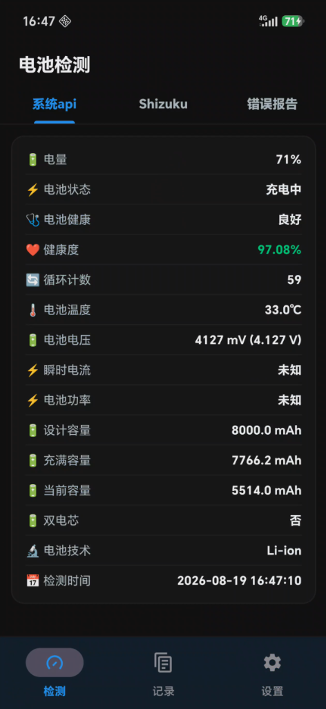
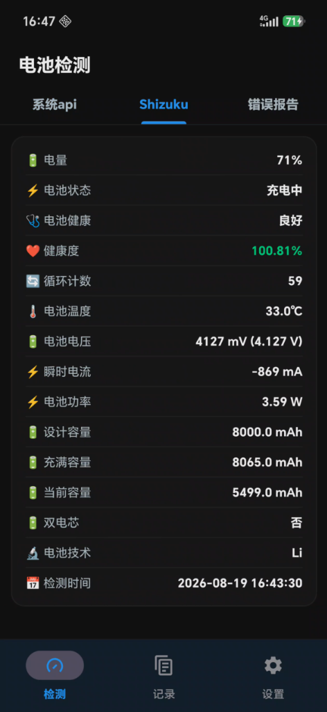
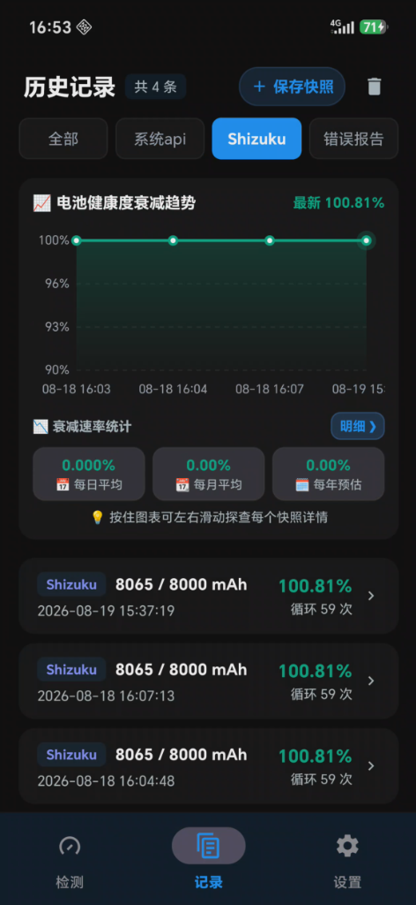
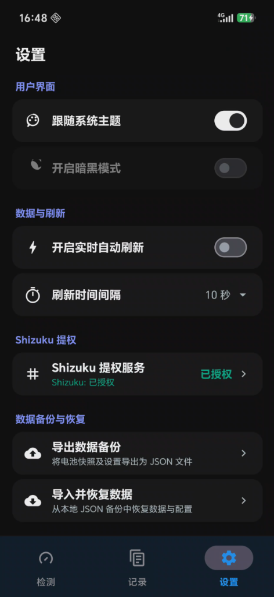

<h1 align="center">🔋 Battery (Battery Health & Hardware Analysis)</h1>

<p align="center">
  <strong>A lightweight, accurate, and modern battery health and hardware analysis tool crafted for Android.</strong>
</p>

<p align="center">
  <a href="README.md">简体中文</a> | <a href="README_EN.md">English</a>
</p>

<p align="center">
  
  
  
  
  
</p>

---

## 📱 Screenshots

<div align="center">

| 🔋 System API Detection | ⚡ Shizuku Privileged Reading | 📈 History Trend & Decay Stats | ⚙️ Settings & Backup |
| :---: | :---: | :---: | :---: |
|  |  |  |  |

</div>

---

## 🌟 Key Features

### 1. 🔍 Triple Data Collection & Deep Parsing Engine
* **System Standard API (BatteryManager)**: Zero barrier to reading system broadcast and standard API data (battery level, charging status, health state, temperature, voltage, current, etc.).
* **Shizuku Privileged Deep Reading (Rootless ADB)**:
  - No root required; obtains underlying shell permissions via Shizuku authorization;
  - Directly reads `/sys/class/power_supply/` driver nodes and `dumpsys` battery services;
  - Extracts real full charge capacity (FCC), cycle count, microampere-level real-time current, and dual-cell battery architecture;
  - Specially adapted for HONOR private battery drivers and node services.
* **Lightning-Fast Bugreport Stream Parsing**:
  - Supports directly importing system bugreport files (`bugreport-*.zip` or `.txt`) ranging from tens to hundreds of megabytes;
  - Employs native **byte stream sliding window fast scanning** to locate and parse the `getHealthInfo` structure within milliseconds;
  - Automatically extracts and displays the actual capture/generation timestamp of the bugreport.

> [!WARNING]
> **⚠️ Device Compatibility Notice**:
> Currently, **Shizuku Privileged Reading** and **Bugreport Parsing** have been **deeply adapted primarily for HONOR devices**. Other brands (such as Xiaomi, OPPO, vivo, Samsung, etc.) have not been extensively tested, and compatibility differences may exist in private kernel driver nodes and bugreport formats. System Standard API detection works on all general Android devices.

---

### 2. 📈 Battery Health Degradation Trend & Multi-period Loss Statistics
* **Smooth Bezier Health Trend Chart**: Canvas hardware-accelerated curve fitting for historical snapshot data, supporting touch gestures to inspect details of each snapshot node.
* **Multi-dimensional Degradation Rate Estimation**:
  - 📅 **Daily Average Degradation (%/day)**;
  - 📆 **Monthly Average Degradation (%/month)**;
  - 🗓️ **Estimated Yearly Degradation (%/year)**.
* **Periodic Loss Breakdown**: Automatically groups and aggregates data by calendar day, month, and year to review starting/ending health percentage changes and charge cycle count increments for each period.

---

### 3. 📊 15 Comprehensive Battery Hardware Parameters
Every parameter is carefully sanitized, validated, and converted into standard physical units:

| Parameter | Description | Source |
| :--- | :--- | :--- |
| 🔋 **Battery Level** | Remaining battery percentage (e.g., `85%`) | System API / Kernel Nodes |
| ⚡ **Status** | Charging / Discharging / Not Charging / Full | Power Management IC (PMIC) |
| 🩺 **Health State** | Android diagnostic state (Good / Overheat / Dead / Over Voltage, etc.) | Android Diagnostic API |
| ❤️ **Battery Health** | Actual health percentage (FCC ÷ Design Capacity) | Precise Algorithmic Calculation |
| 🔄 **Cycle Count** | Equivalent charge/discharge cycles recorded by fuel gauge | Hardware Fuel Gauge Counter |
| 🌡️ **Temperature** | Real-time Celsius temperature (accurate to `0.1°C`) | Internal Battery Thermistor |
| 🔋 **Voltage** | Real-time terminal voltage (`mV` / `V`) | Analog-to-Digital Converter (ADC) |
| ⚡ **Current** | Real-time charge/discharge current (`mA`, with clear +/- direction) | Coulomb Counter Sensing Resistor |
| ⚡ **Power** | Real-time instantaneous operating power (`W`) | Dynamic Power Calculation Formula |
| 🔋 **Design Capacity** | Factory nominal design capacity (`mAh`) | PowerProfile / Kernel Parameters |
| 🔋 **Full Charge Capacity (FCC)** | Estimated maximum capacity when battery is fully charged (`mAh`) | Fuel Gauge Learned Capacity |
| 🔋 **Current Capacity** | Remaining available capacity (`mAh`) | Coulomb Counter Charge Tally |
| 🔋 **Dual Cell** | Identification of dual-cell (series/parallel) architecture | Hardware Topology Detection |
| 🔬 **Technology** | Battery chemistry/material type (e.g., `Li-ion`, `Li-poly`) | Hardware Properties |
| 📅 **Capture Time** | Exact date and time when the detection or bugreport was taken | Automatic Timestamp |

---

### 4. 🎨 Modern Material 3 UI & Fluid Interactions
* **Material 3 Bottom Navigation**: Three core sections: "Detection", "History", and "Settings".
* **Gestures & Pull-to-Refresh**: Integrated `SwipeRefreshLayout` with smooth pull-down refresh animations.
* **Grouped Card Settings**:
  - Categorized cards for User Interface, Data & Refresh, Shizuku Privilege, and About;
  - Consistent `56dp` physical height with auto-centering alignment;
  - Precision right-aligned compact popup menu that smoothly unfolds from top-right (supporting 1s / 2s / 3s / 5s / 10s refresh intervals).
* **System-wide Dark Theme & Rounded Ripple Effects**:
  - Flawlessly supports light and dark (AMOLED true black/dark grey) themes;
  - Rounded mask-clipped ripple feedback for refined aesthetics without clipping overflow.

---

## 🛠️ Technical Architecture

* **Programming Language**: 100% [Kotlin](https://kotlinlang.org/)
* **Architecture Pattern**: MVVM (Model-View-ViewModel) + Unidirectional Reactive Data Flow
* **Asynchronous & Concurrency**: Kotlin Coroutines + Flow / StateFlow
* **View Binding**: Android Jetpack ViewBinding
* **Component Libraries**:
  - Google Material Components 3 (`com.google.android.material:material:1.11.0`)
  - AndroidX SwipeRefreshLayout (`androidx.swiperefreshlayout:swiperefreshlayout:1.1.0`)
  - Rikka Shizuku API (`dev.rikka.shizuku:api:13.1.5` / `provider:13.1.5`)
  - AndroidX Lifecycle & ViewModel KTX (`2.7.0`)
  - Kotlinx Coroutines Android (`1.7.3`)

---

## 📦 Project Structure

```
Battery/
├── app/
│   ├── src/main/
│   │   ├── java/com/battery/analysis/
│   │   │   ├── model/                  # Battery parameters and result models (BatteryInfo, HealthInfoItem)
│   │   │   ├── provider/               # Data providers (NormalApi, Shizuku, BugreportParser, Fusion)
│   │   │   ├── ui/                     # UI layer (Fragments, ViewPager2 adapters, ViewBinder)
│   │   │   ├── viewmodel/              # Business logic & state flow ViewModels
│   │   │   └── MainActivity.kt         # Main Activity (navigation & lifecycle coordination)
│   │   └── res/
│   │       ├── anim/                   # Popup animation resources
│   │       ├── color/                  # State color selectors
│   │       ├── drawable/               # Vector icons and card backgrounds
│   │       ├── layout/                 # Layout XML files
│   │       ├── values/                 # Theme styles, strings, and light color palette
│   │       ├── values-en/              # English string resources
│   │       └── values-night/           # Dark theme and high contrast color palette
├── .github/workflows/                 # CI/CD automated build and release workflows
└── build.gradle.kts                   # Top-level and module-level build configurations
```

---

## 🚀 Build & Setup

### 1. Prerequisites
* **Android Studio**: Hedgehog (2023.1.1) or higher
* **JDK**: OpenJDK 17 or higher
* **Android SDK**: API 34 (Android 14)

### 2. Local Build Steps
```bash
# Clone the repository
git clone https://github.com/zhyang18/Battery.git
cd Battery

# Build Debug APK
./gradlew assembleDebug

# Build Release APK
./gradlew assembleRelease
```
Compiled APK artifacts are located in the `app/build/outputs/apk/` directory.

---

## 📱 Usage Guide

1. **Standard Detection**: Open the app, navigate to the "Detection" tab, and swipe down to refresh all battery metrics fetched via standard APIs.
2. **Shizuku Privileged Detection**:
   - Install and start [Shizuku](https://shizuku.rikka.app/) on your device (pair via Wireless Debugging or PC ADB);
   - In the app's "Settings" tab, click "Request Auth" or switch directly to the "Shizuku" tab. Once granted, real fuel gauge cycle counts and low-level parameters will be parsed in real time.
3. **Bugreport Analysis**:
   - In "Developer options" on your device, tap "Take bugreport";
   - Once completed, go to the "Bugreport" tab and click "Import Bugreport", select the generated `.zip` or `.txt` file, and the app will instantly parse and present the capture time along with detailed battery health metrics.

---

## 📄 License

This project is licensed under the [MIT License](LICENSE).
